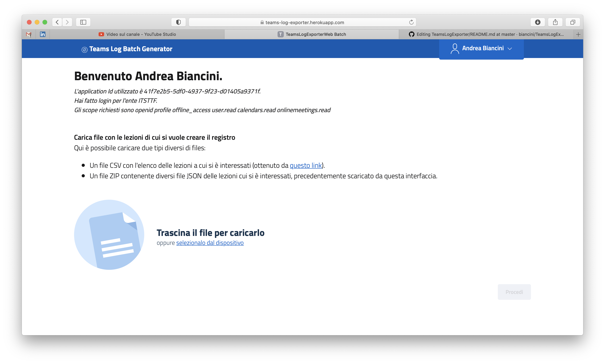

TeamsLogExporter
================

This project aims at creating a simple application that allows you to download the logs (both in technical and Excel format) of all the meetings held over a certain period from Microsoft Reams.

You can see it in action at [this youtube video](https://youtu.be/s_GNMujBYFk) (only in Italian).

This is very useful for reporting on educational activities and, therefore, for tracking students' attendance during online lessons in DAD.

The application shown is available (while free quotas are exhausted) at [this link](http://teams-log-exporter.herokuapp.com/batch/).

To download and run the application on other environments of your property, you can use the source code available [here](https://github.com/biancini/TeamsLogExporter).

This simple project is managed with an open source logic, as you can see, so I would be very grateful if, if you made any improvements or new features, you would like to share them by making a PR to this repository.
